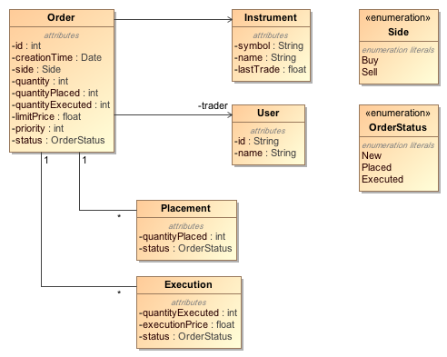
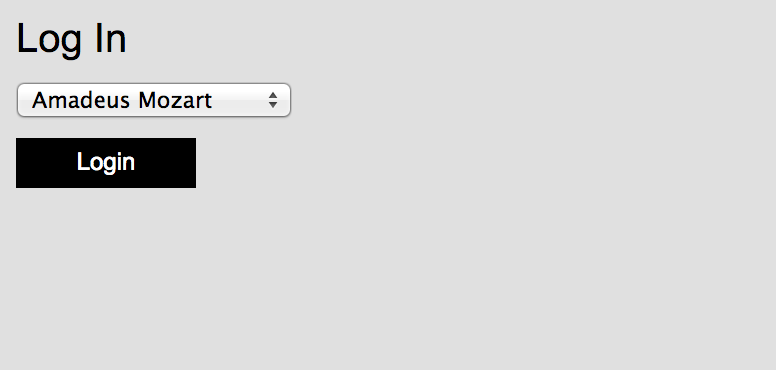
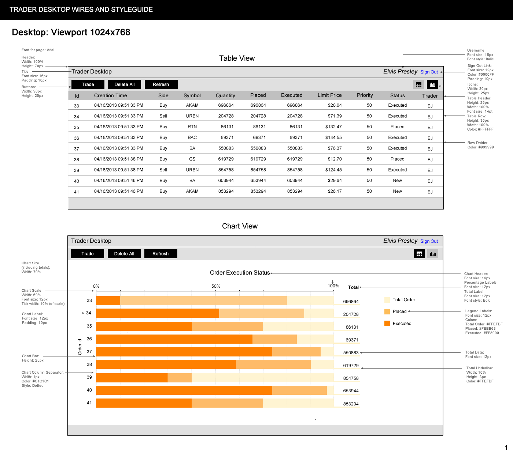
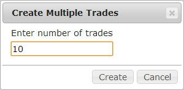
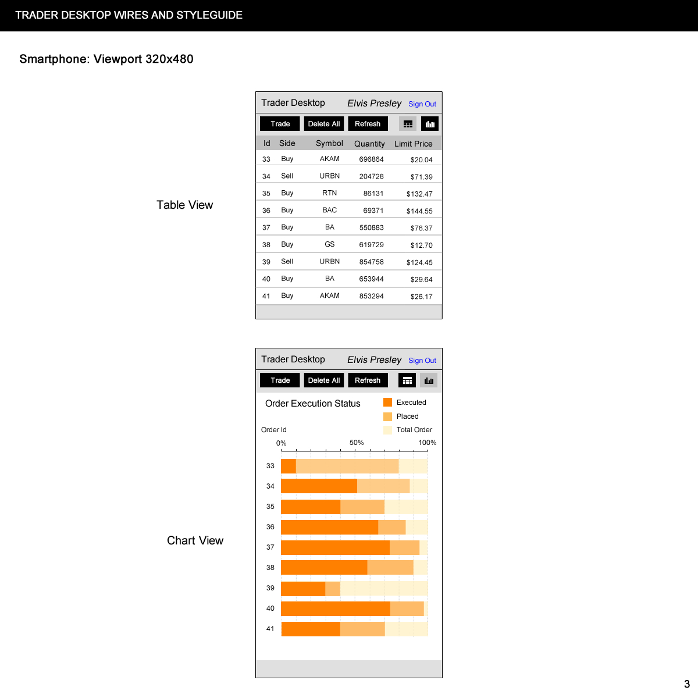
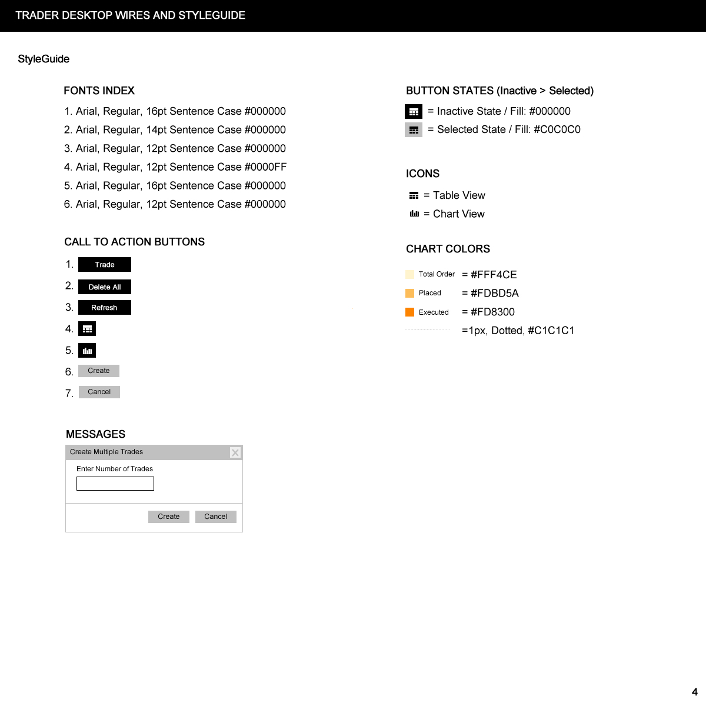

Trader Desktop
==============

This is an exercise in learning key web technologies using a simple trading scenario.

Domain Model
------------

The business domain consists of `Instrument`s that can be traded in a market. We will limit the scope of instruments to equities, also knows as stocks in a company. For example, we can trade stocks of Apple whose market symbol is AAPL.

Traders (who are system `User`s) can place `Order`s for different instruments in the stock market. Orders placed by traders are sent to a server which manages the actual placement of the orders in the market. When it received a large order, it may be broken in to smaller chunks called `Placement`s and push them to the market at different times. This is to make sure that large orders do not swing the market in unintended ways. Also a large order may not get filled in one shot, it may require several `Execution`s to fill depending on the supply and demand of the stock.

The server keeps the trader informed about their orders. In fact, it keeps all traders informed of all orders in execution, whether placed by them or some other trader.

Server RESTful API
------------------
For this exercise the server has been completely coded - you don't have to worry about it. You will only be coding the front-end client.

The server exposes three RESTful resources: Users, Instruments and Orders. These resources are described below.

### Users ###

#### Get Users
Returns all Trader Desktop users. Assume all these users are traders.

##### Request
    GET http://localhost:8080/rest/users HTTP/1.1

##### Response
    HTTP/1.1 200 OK
    Content-Type: application/json

    [
      {
        "id": "AM",
        "name": "Amadeus Mozart"
      },
      {
        "id": "AR",
        "name": "A. R. Rahman"
      },
      ...
    ]

### Instruments ###

#### Get Instruments
Returns all instruments traded at the exchange.

##### Request
    GET http://localhost:8080/rest/instruments HTTP/1.1

##### Response
    HTTP/1.1 200 OK
    Content-Type: application/json

    [
      {
        "symbol": "AAPL",
        "name": "Apple Inc.",
        "lastTrade": 98.7
      },
      {
        "symbol": "ADBE",
        "name": "Adobe Systems Inc.",
        "lastTrade": 13.13
      },
      ...
    ]

### Orders ###
An order object has the following properties:

    id: int
    creationTime: date,
    side: 'Buy' | 'Sell'
    symbol: String
    quantity: int
    quantityPlaced: int
    quantityExecuted: int
    limitPrice: float
    priority: int  [1 (Low) - 100 (High)]
    status: 'New' | 'Placed' | 'Executed'
    traderId: String

#### Get Orders
Returns all orders saved on the server.

##### Request
    GET http://localhost:8080/rest/orders HTTP/1.1

##### Response
    HTTP/1.1 200 OK
    Content-Type: application/json

    [
      {
        "id": 78,
        "creationTime": "2013-04-16T22:41:51.380Z",
        "side": "Buy",
        "symbol": "DIS",
        "quantity": 983444,
        "quantityPlaced": 983444,
        "quantityExecuted": 983444,
        "limitPrice": 31.46,
        "priority": 50,
        "status": "Executed",
        "traderId": "AM"
      },
      ...
    ]

#### Create Order
Creates an order on the server.

##### Request
    POST http://localhost:8080/rest/orders HTTP/1.1
    Content-Type: application/json

    {
        "side": "Buy",
        "symbol": "AAPL",
        "quantity": 10000,
        "limitPrice": 426.24,
        "traderId": "AM"
    }

##### Response
    HTTP/1.1 201 Created
    Content-Type: application/json

    {
      "id": 10,
      "creationTime": "2013-04-17T00:01:18.000Z",
      "side": "Buy",
      "symbol": "AAPL",
      "quantity": 10000,
      "quantityPlaced": 0,
      "quantityExecuted": 0,
      "limitPrice": 426.24,
      "priority": 50,
      "status": "New",
      "traderId": "AM"
    }

#### Delete All Orders
Deletes all orders on the server.

##### Request
    DELETE http://localhost:8080/rest/orders HTTP/1.1

##### Response
    HTTP/1.1 200 OK

Server Events
-------------
In addition to the RESTful resources, the server also pushes events to the client using WebSockets. This is to make sure that all clients are aware of what is going on. For example, an order placed by trader A should be visible to all other traders. Server events are described below.

#### orderCreatedEvent
The payload contains the order that was created.

#### placementCreatedEvent
The payload contains the placement that was created:

    orderId: int
    quantityPlaced: int
    status: 'New' | 'Placed' | 'Executed'

#### executionCreatedEvent
The payload contains the execution that was created:

    orderId: int
    quantityExecuted: int
    executionPrice: float
    status: 'New' | 'Placed' | 'Executed'

#### allOrdersDeletedEvent
This event is sent when all orders on the server are deleted.

Build Instructions
------------------
As mentioned earlier the server is fully coded. Use the instrunctions below to build and run it.

### Install Build Tools ###
* Install [Node.js](http://nodejs.org/).
* Install [Grunt](https://github.com/gruntjs/grunt/wiki/Getting-started).

    $ npm install -g grunt-cli

### Build the Server ###
* Clone the Trader Desktop repository on your machine.
* Open a command shell and change the directory to your local instance of the Trader Desktop repository.
* Install the require NPM packages:

    $ npm install
* Start the server using the following command:

    $ npm start
* Make sure the server is running by pointing your browser to [http://localhost:8080](http://localhost:8080). You should see the server home page with the message "This is the Trader Desktop server".

Running Server Diagnostics
--------------------------
We have a seperate web application that allows you to run more extensive diagnostics for the Trader Desktop server. This application is also very instructive to understand how the server API really works. Go to the [Trader Desktop Server Diagnostics](https://github.com/archfirst/trader-desktop-server-diagnostics) repository, build and run the application.

Trader Desktop Exercise
-----------------------
Now that we understand the business domain and the server API, we are now ready to describe the front-end exercise. You can build the front-end in the technlogy of your choice!

### Login Screen

The login screen allows the user to select their name. No passwrod is required.

### Trader Desktop

The trader desktop shows all the trades that have been placed by all traders, with real time updates on placement and execution status. The trader desktop has two display modes - table and chart. The mode can be be changed by clicking on the table and chart icons (these are provided in the assets directory).

The three buttons at the top have the following functionality:

#### Trade
Pops up a dialog box asking for the number of trades to create. Just create the requested number of trades using random symbols, quantities etc.

#### Delete All
Send a messeage to the server to delete all existing orders. This is primarily for debugging purposes.

#### Refresh
Rrefresh the desktop. This should get a fresh copy of all trades from the server and redisplay them. This is primarily for debugging purposes.

### Push Notifications
Make sure you listen to the push notifications sent by the server and update orders stored in the front-end accordingly. In fact, you should not update orders based on user actions. User actions should simply be sent to the server and then wait for server's push notifications to update local orders. This allows all front-ends users to see order updates simultaneously. A good test of your implementation is to open Trader Desktop on multiple browsers or browser tabs. Performing actions in one browser should update information on all browsers running Trader Desktop.

### Brownie Points
For bonus points, make the Trader Desktop responsive. Here's a mobile design to get your creative juices flowing:

### Style Guide
Use the style guide below to implement the visual design with precision.

